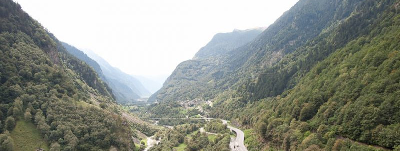

Welcome to the Block n°6 of the Jedha's certification !...
 - Analysis, Evolution and predictions of Swiss Protective Forests - 

Name : DINE Aloïs Jesshuan
e-mail : jesshuan.dine@gmail.com

Lien vidéo de la présentation :
https://share.vidya

-------------------
ABOUT THE GLOBAL COLLABORATIVE PROJECT
-------------------

Presentation :

An analysis of the state of protective forests in Switzerland : main factors of growth and health and first modelling approaches to predict the future of these forests...

-> Presentation of the project available on the Jedha Bootcamp youtube channel during the DemoDay (8min):
https://www.youtube.com/watch?v=Hbn9JkuRaWk&t=9036s
(our presentation start at 1h 22m 40s)

-> The presentation with slides is also added in this repository : Protective Forest CH.pptx

Team Main contribution :

- Dashboarding: Marjory Lamothe
- Satellite data gathering and aggregation: myself
- Climatic data analysis: Arnaud Barraquand ([Git repo](https://github.com/Ukratic/Protection-Forests))
- Scientific expertise: Estelle Noyer ([Git repo](https://github.com/NoyE-R/JF_B6_ProtectiveForest/blob/main/README.md))
- Modeling: all members.

Context and final objective :

(author : Arnaud Barraquand)

Temperatures are rising considerably faster in Swiss forests than Switzerland at large, which already has temperatures rising faster than the global trend.
Climate change also brings instability : drought, storms, floods... Precipitation data is not entirely conclusive on this evolution, but there are worrying signs.
Protection forests are generally well-managed and still expanding (though much less now than in previous decades). Their role is so important however, that it is crucial to monitor their health.
Many such forests protect cities, towns and villages but also roads and critical infrastructure from rockfalls, avalanches, landslides...
A reliable model of the evolution of these forests and main factors responsible would help to anticipate changes in their growth, what caused them and come up with preventative measures if necessary.

This is the purpose of this study : An overview of the current situation and an attempt at identifying key elements through analysis and modeling.

Dataset :

(author : Estelle Noyer)

The used dataset includes three kind of data:

- National Forest Inventory (NFI) data : field measurements of the typographical and structural variables from 1983 to 2017
- Historical climatic data (WSL): monthly temperature and precipitation records
- Satellite data (Google Earth Engine): satellite images of each forest plots from LANDSAT 5 and 7.
NB: due to the size of the data (large volume), requests to satellites were done by all members of the team using a automation script and a special env with Docker image.

Outputs Results take form through :

Dashboard with EDA and modeling analysis of the forest, and a presentation of our model's performances :
Availaible on [this link](https://ukratic-protection-forests-dashboard-home-fsgk56.streamlit.app/)

Analytical approach :

(author : Estelle Noyer)

Three targets were selected in order to get different point of view defining the health of forests:
Basal Area: biomass production at time t (feature : SURF_TER_HA)
Wood volume increment: growth of the forest plot between two forest surveys (features : ACCR or ACCR_UNIT)
Regeneration cover rate: development ability of the forest in the future, i.e. stability of the forest. (feature : TAUX_COUV_RAJ)

Descriptive models :

All the "descriptive" models in Machine Learning and Deep Learning were been built to respond to two objectives :
- What are the main factors of the health of the protective forests ? (To describe the forest at time t by all the features at time t, and to make features extraction.)
- Can we correlate satellite and weather data with our health indicators ? (to add or substract theses features and to look performances)
Preprocessing were similar, but each target was the subject of a different technique.
Models tested : Simple Linear Regressor, Ridge Regressor, Ridge Classifier, Lasso, Random Forest, Decision Tree, Hist Gradient Boost, Categorical Naive Bayes...

Predictive models : 

All the "predictive" models in Machine Learning and Deep Learning were been built to repond to one objective :
- In a time-based perspective, and if we didn't have all the informations from the field (NFI Data), can we predict the future of a protective forest ?...
For this objective, various approaches are possible :
- we just keep NFI informations at t-1 and SAT / Meteo data at t and we try to predict our target at t (similar to a descriptive model)
- we have NFI informations of t-3, t-2, t-1... and we try to predict t (it's a "time series" problematic)
- we have NFI informations of t-3, t-2, t-1... and we have SAT / Meteo data at t, and we try to predict t (it's a "time series" problematic with time dependent regressors)
Models tested : Ridge Regressor, Ridge Classifier, XGBoost, Multi-Layers Dense, Mutli-Layers RNN with additional pipeline of Multi-Layers Dense...

Conclusion

We have noticed, first of all, and despite an overall increase in the volume of forests, a slowing down of this growth and of the renewal of young trees for a majority of plots, coupled with an increase of 3°C in certain forest areas of Switzerland, and a decrease in precipitation (increased drought).
This could become a problematic situation in the long run, especially since the protection forests in Switzerland represent 43% of the forest area, thus increasing the risk of rock falls and other natural hazards.

The forest modelling work, thanks to the field data, has allowed to highlight important correlations, most of them logical and mechanical, which allow to confirm some important intuitions on the way forests renew themselves and/or grow... On the other hand, the satellite data and the historical weather data in our possession did not really allow us to add information to these field data, and the correlations, although present, struggle to be representative and generalizable.
Whether our models are in "descriptive" or "predictive" mode, each model is essentially based on field data, i.e. NFI data. We therefore recommend the continuation of these indispensable surveys, while waiting for technologies (some of which obviously already exist, such as LIDDAR) to ensure this range of surveys. 
On the other hand, interesting leads were found during this modeling, which would simply require better quality data: a Hist Grandient Boost Regressor model, for the "descriptive" part, as well as a Multi-Layers RNN GRU model, for the "predictive" part, a model adapted to time series prediction problems, which seems to "keep" its regressor capacity for an important number of features.

-------------------
ABOUT MY PERSONAL CONTRIBUTION AND THIS GIT REPOSITORY
-------------------

4 Folders to explain step by step  my contribution on this project

With my collaborators, I was involved in the data exploration and the collective reflexion about data acquisition and data managment. I have provided, throughout the entire project, a lot of scripts to manage, to merge, to aggregate and to convert data... For example,  a script to convert swiss spatial coordinates (a very particular system !) into GPS coordinates. -> REPO 1 : DATA_global_processing

Then, my personnal task was to manage and to organize the satellite data collection. I tried to learn basical commands on the librairie of Google Earth Engine, to explore some code examples, to make researchs and read some documentations on spectral bands and spectral functions specialized on vegetation monitoring, to make little test of images capture... Then, objective was to automate the processus and paralellize the 4 collection captures (1 by campaign of LFI data) with our 4 local machines (approx. 10GB and 10-12hrs of computing time by collection). So, I decided to create a litle jupyter lab environnement (with a Docker image) to share this automation process. After that, I maked a final script for all my collaborators to convert images colection (in json format, with a list numpy array for image for each spectral function) to a single one aggregated data (the mean of each pixels of the image, cut out a 25X25 meters square)
-> REPO 2 : DATA_satellites_images_acquisition_and_aggregation

When we merged all the data (Météo / Satellite / field data), then, we were able to train and test different models in Supervised Machine Learning (including Deep Learning) to satisfy our different objectives, on a "descriptive" mode and on a "predictive" mode (as it is described above)...

Personnaly, for the "descriptive" mode, I tried to build very simple models like Simple Classifier (from scikit-learn), Ridge, Lasso... because my interest was esssentialy to understand the importance of each feature in the predictions (feature extraction) and not to increase performances -> REP0 3 : Machine_Learning_Descriptive_models

For the "predictive" mode, first, I built some scripts to preprocess the data in a temporal problematic (for two differents approches, as it is described above)... Then, I built differents models, from the more simple to the more complex. My favorite models were the lastest : A GRU Multi-layers in deep learning, cause I was armed with the conviction that RNN is a good answer for a "time series problem", especially when we have a small amount of temporal points (but a lot of data for each point), and the same, but with a parellelize pipeline to incorpore the present's informations (and satellite data). Even if all the performance were not very extraordinary, theses models were the best (in predictive capacity) at this step of the project, for the "predictive" mode. Ways that should be explored further...
-> REPO 4 : Machine_Learning_Predictive_models

Another of my contributions was, in the context of our collective reflection, to put in discussions theses differents approches around the elaboration of our models, with a great specially interest in the modelization and the relationship of it with time. (to see the draft diagram about theses different approches, don't be afraid, it's a draft...).
Time is a fascinating subject and I think that the field of Machine Learning has not finished delivering all these mysteries on the relationship with it... In some cases, time must be ignored, and in others it must be completely reintegrated. It is these choices and questions that fascinate me most in modeling problems. (in addition to the forests!...)

-------------------
OTHER CREDITS
-------------------

